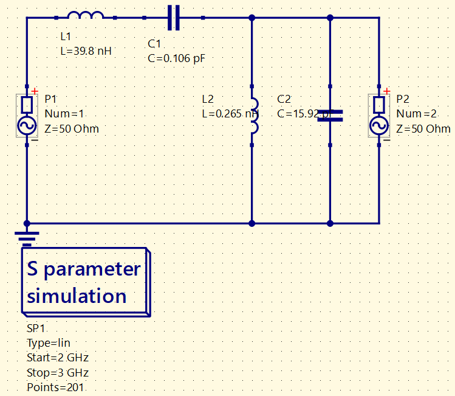
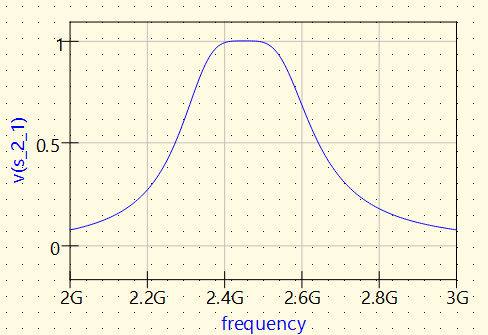
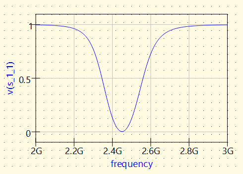
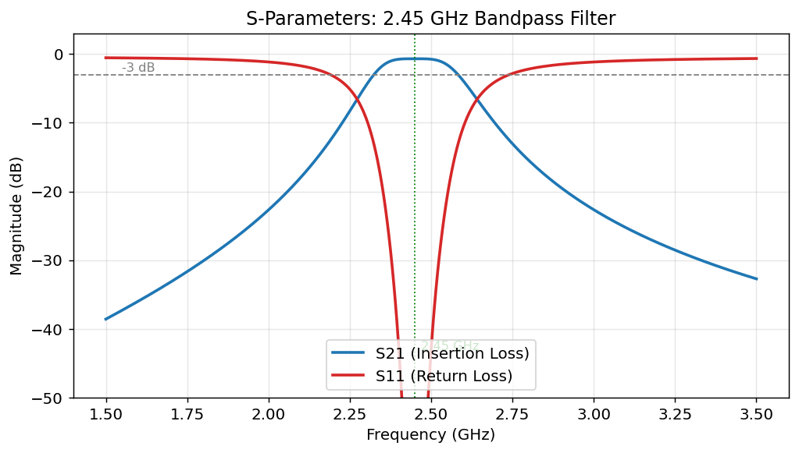
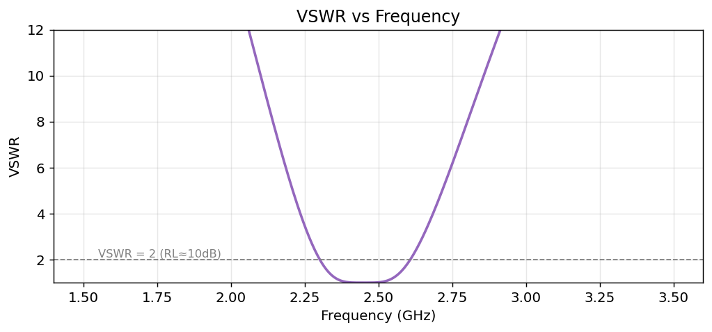
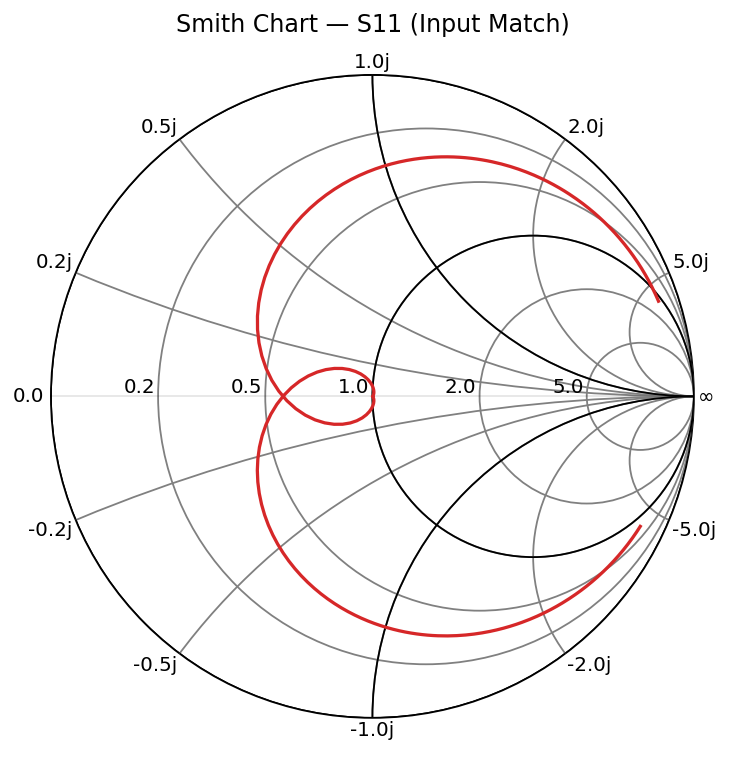

# S-Parameter Analysis of a 2.45 GHz Bandpass Filter — MATLAB & Qucs-S

A two-part RF project on the scattering parameters (S-parameters) of a two-port bandpass filter centered at 2.45 GHz:

1. **Design & simulation (Qucs-S):** a lumped-element bandpass filter is designed, built as a schematic, and simulated with the Ngspice backend to obtain its S-parameters from circuit physics.
2. **Analysis & visualization (MATLAB):** S-parameter data is plotted and interpreted using the three standard views an RF engineer reads — magnitude response, VSWR, and a Smith chart.

Together they cover the full loop: design a filter, simulate it, then analyze the response.

## What are S-parameters?

Scattering parameters describe how a high-frequency network responds to signals at its ports in terms of reflected and transmitted power waves. At RF, voltage and current are hard to probe directly, so S-parameters are the standard language for characterizing filters, amplifiers, antennas, and interconnects.

For a two-port device:

| Parameter | Name | Meaning |
|-----------|------|---------|
| **S11** | Input reflection coefficient | Fraction of the signal reflected back at port 1. Lower is better. |
| **S21** | Forward transmission | Fraction transmitted from port 1 to port 2 (gain or loss). |
| **S12** | Reverse transmission | Leakage from port 2 back to port 1 (isolation). |
| **S22** | Output reflection coefficient | Reflection looking into port 2. |

Derived figures of merit used here:

- **Return Loss** = -S11 (dB). A return loss of 20 dB means only 1% of incident power is reflected. Higher is better.
- **Insertion Loss** = -S21 (dB) for a passive device — how much signal is lost passing through.
- **VSWR** (Voltage Standing Wave Ratio) restates S11 as a standing-wave ratio. VSWR = 1 is perfect; VSWR < 2 (return loss > 10 dB) is a common acceptability threshold.

## Filter specification

| Parameter | Value |
|-----------|-------|
| Type | 2nd-order LC bandpass |
| Center frequency | 2.45 GHz (2.4 GHz ISM band) |
| Bandwidth | ~200 MHz |
| Reference impedance | 50 ohm |

The topology is a **series resonator in the signal path** (L1, C1) followed by a **parallel resonator to ground** (L2, C2). The series branch is a near-short at 2.45 GHz (passes the signal); the parallel branch is a near-open at 2.45 GHz (does not drain it to ground). Component values, computed from the bandpass transformation of a 50 ohm prototype:

| Component | Branch | Value |
|-----------|--------|-------|
| L1 | series (path) | 39.8 nH |
| C1 | series (path) | 0.106 pF |
| L2 | shunt (to ground) | 0.265 nH |
| C2 | shunt (to ground) | 15.92 pF |

---

## Part 1 — Design & Simulation in Qucs-S

The filter was built as a schematic in Qucs-S and simulated with the Ngspice backend over a 2-3 GHz linear sweep (201 points).

### Schematic



### Results

S-parameters are shown as **linear magnitude** (the Ngspice backend in this setup exposes the raw magnitude rather than a dB function): **1.0 = full transmission / no reflection, 0 = none**.

**Transmission, S21 (`v(s_2_1)`)** — peaks at ~1.0 at 2.45 GHz, confirming the passband:



**Reflection, S11 (`v(s_1_1)`)** — dips toward 0 at 2.45 GHz, confirming a good input match in-band:



The transmission peak and the reflection minimum coincide at 2.45 GHz, which is the signature of a correctly matched bandpass filter. Because the simulation uses ideal lossless components, in-band transmission reaches nearly 1.0 (approx. 0 dB insertion loss).

---

## Part 2 — Analysis & Visualization in MATLAB

The MATLAB side plots and explains S-parameter data using a self-contained script (`matlab/sparams_no_file.m`). The data is generated inside the script from a filter model, so it runs immediately with no external files, no toolboxes, and no path setup. The Smith chart is drawn directly from the reflection-coefficient grid, so the RF Toolbox is not required.

Metrics printed by the script:

```
Reference impedance        : 50 ohm
Centre frequency (S21 peak): 2.450 GHz
Insertion loss at centre   : 0.70 dB
-3 dB passband             : 2.315 - 2.595 GHz (BW = 280 MHz)
Return loss at centre      : 30.5 dB
VSWR at centre             : 1.06
```

### Figure 1 — S11 and S21 magnitude (dB)



S21 peaks near 0 dB at the center frequency and rolls off on either side, defining the passband. S11 drops sharply at the center frequency — when matched, almost no power is reflected. Note the complementary relationship: where transmission is high, reflection is low. The -3 dB points on S21 set the passband edges.

### Figure 2 — VSWR



VSWR mirrors S11. It sits near 1 across the passband (matched) and rises steeply in the stopband, where the filter rejects energy by reflecting it. This is the quantity most directly compared against a vector network analyzer measurement.

### Figure 3 — Smith chart of S11



Each point on the trace is the input impedance at one frequency, normalized to 50 ohm. The center is a perfect 50 ohm match; the right edge is an open circuit and the left edge a short. As frequency sweeps, the trace loops, passing closest to the center near resonance — the visual signature of a well-matched device.

### Running the MATLAB script

Requirements: **MATLAB** (base installation is sufficient).

```matlab
% Open matlab/sparams_no_file.m and press Run (F5), or:
run('matlab/sparams_no_file.m')
```

An optional commented section at the end shows the RF Toolbox versions (`rfplot`, `smithplot`) built from the same in-memory data — still no file to import.

---

## Repository layout

```
.
├── README.md
├── docs/        figures (schematic + MATLAB and Qucs-S plots)
├── matlab/      MATLAB script(s)
└── qucs-s/      Qucs-S project files (schematic, dataset)
```

## Notes

The MATLAB data is generated from an analytical filter model, and the Qucs-S simulation uses ideal lossless components. Both are intended to demonstrate the computation, plotting, and interpretation of S-parameters. A physically built filter would show additional effects — component parasitics, dielectric and conductor losses, and fabrication tolerances — that shift and degrade the response, especially as frequency increases.

A practical observation from the design: the required series capacitor (C1 = 0.106 pF) is impractically small for a real lumped component at 2.45 GHz. This is the known limitation of lumped-element filters near the 2.4 GHz band, and the reason production designs at this frequency typically move to distributed (microstrip) structures.

## License

MIT
